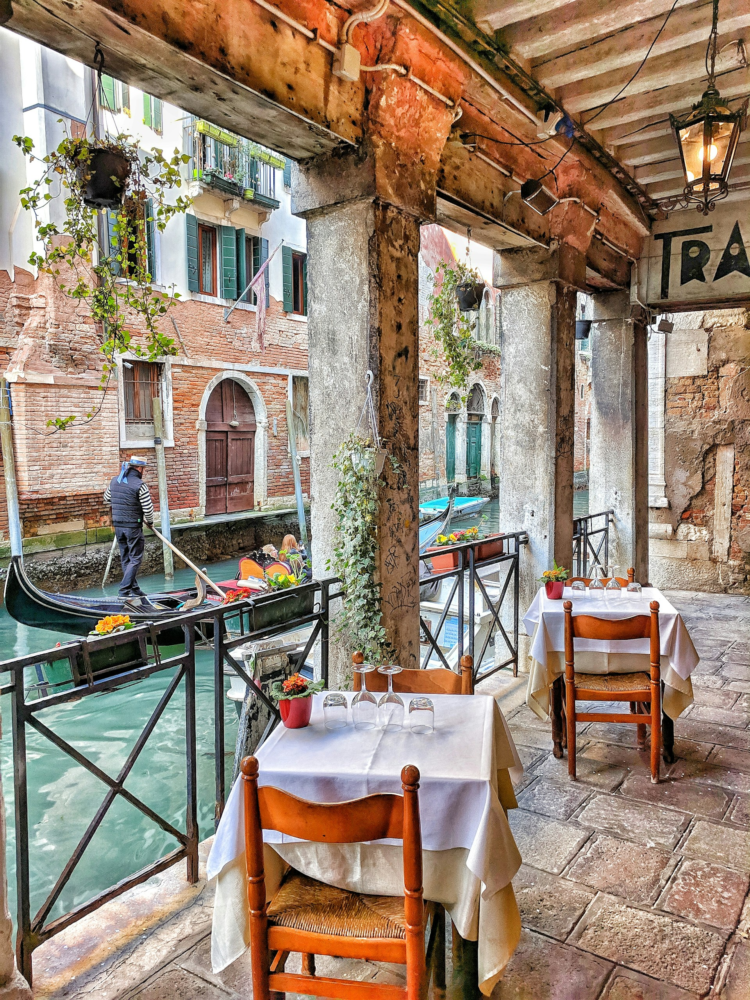
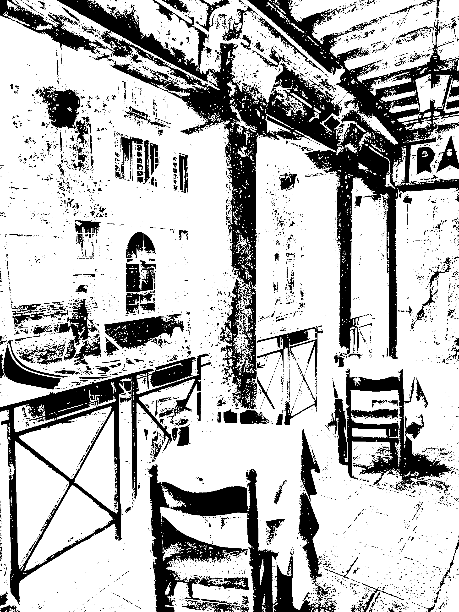
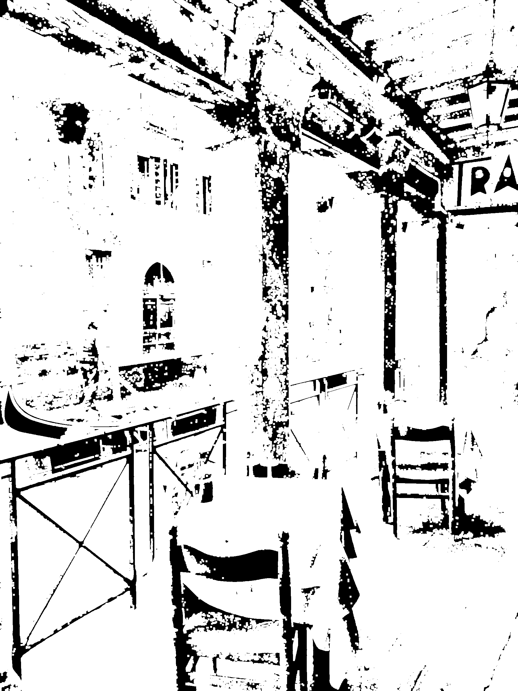
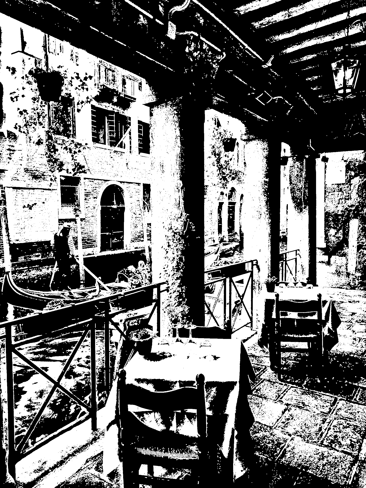
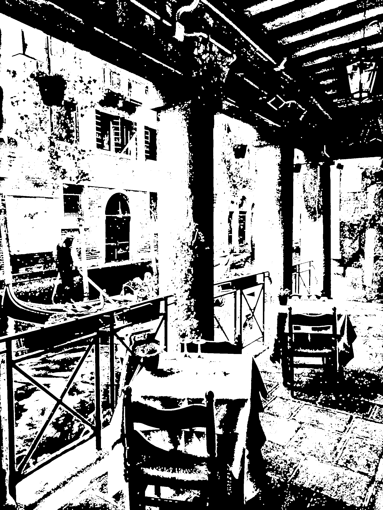
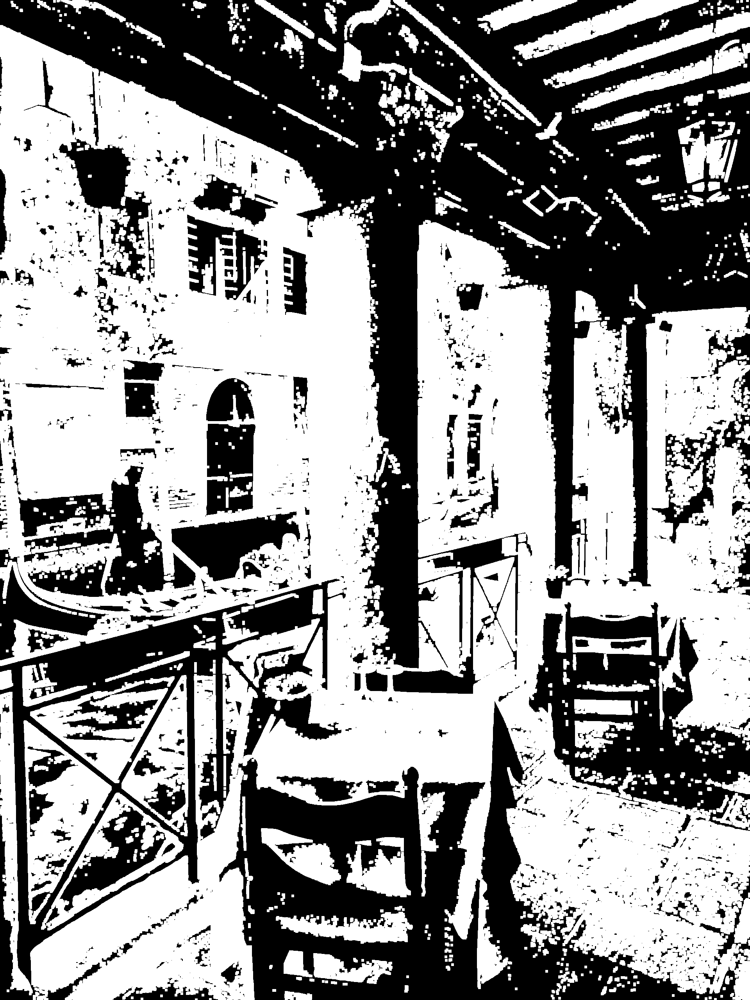

# Задача обработки изображений

## Общая задача
Написать программу на любом языке программирования. 
Произвести тестирование программы для разных размеров обрабатываемых файлов изображений. 
Для тестирования взять файлы размерами: 1024 x 768, 1280 x 960, 2048 x 1536. 
Получить среднее значение работы процедуры обработки каждого изображения при троекратном перезапуске программы. 

## Конкретная задача
Загрузить цветное изображение. <br>
Получить значения интенсивности I<sub>v</sub> = (Red<sub>v</sub> + Green<sub>v</sub> + Blue<sub>v</sub>) / 3,
где <br> I<sub>v</sub> – интенсивность пикселя v, <br> Red<sub>v</sub> – значение красной компоненты пикселя ν, 
<br> Green<sub>v</sub>– значение зелёной компоненты пикселя ν, <br> Blue<sub>v</sub>– значение синей компоненты пикселя ν. 

Установить значение скалярной величины - порога Threshold (любое число от 1 до 255). Те значения интенсивности, которые меньше порогового значения установить в 0, а которые больше Threshold установить в 1.
Выполнить операцию наращивания (диляции/ дилатации) [cтатья на habr](https://habr.com/ru/post/113626/) или https://intuit.ru/studies/courses/10621/1105/lecture/17989?page=4 над полученной матрицей из 0 и 1. <br> **Примечание**: нужно задать шаг наращивания (любое значение от 1, 2 или 3). Получить изображение из результата путем установки вместо значений 0 – пикселей черного цвета (0, 0, 0), и вместо значений 1 – пикселей белого цвета. Сохранить результат в файл.

## Пример выполнения

Исходное изображение (размер изображения 1920×2560): 

Результат после наращивания с **Threshold = 120** и **step = 1**

Результат после наращивания с **Threshold = 120** и **step = 2**

Результат после наращивания с **Threshold = 120** и **step = 3**

Результат после наращивания с **Threshold = 180** и **step = 1**

Результат после наращивания с **Threshold = 180** и **step = 2**

Результат после наращивания с **Threshold = 180** и **step = 3**


## Пример использования

```java
package imagecpu;

import java.awt.image.BufferedImage;
import java.util.List;

public class Main {
    public static void main(String[] args) {
        // Папка для сохранения результатов
        String outputPath = "images/results";

        // Создание объектов для обработки
        Binarizer binarizer = new Binarizer(180); // порог бинаризации
        ImageFormatter formatter = new ImageFormatter(3); // шаг дилатации

        // Загрузка изображений
        List<BufferedImage> bufferedImages = ImageUtils.load(
                "images/pic3.jpg",
                "images/pic4.jpg",
                "images/pic5.jpg"
        );

        // Преобразование в бинарные изображения
        List<BinaryImageData> binaryImageDataList = binarizer.binarize(bufferedImages);

        // Обработка и сохранение
        for (BinaryImageData data : binaryImageDataList) {
            // Расширение белых пикселей (дилатация)
            formatter.dilate(data.pixels(), data.width(), data.height());

            // Преобразование массива байт в BufferedImage
            BufferedImage image = ImageUtils.toBufferedImage(data.pixels(), data.width(), data.height());

            // Сохранение изображения (имя генерируется автоматически)
            ImageUtils.save(image, outputPath);
        }
    }
}

